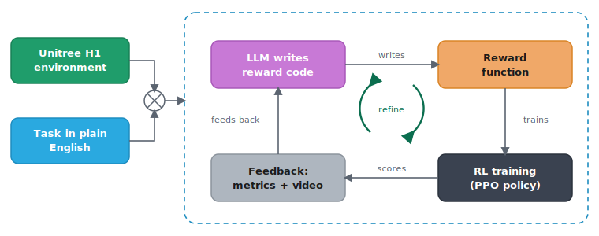

# Can a robot do the chores if I just ask it nicely?

*A 24-hour experiment in LLM-written reward functions.*

*[Cover video: a Unitree H1 humanoid walking to a goal under an LLM-written reward — [watch it here](https://hspoon-aws.github.io/llm-reward-humanoid-rl/blog/blog.html).]*

## The question that started it

My wife asked me a fair question over dinner: *"Why can't we just buy a home robot and tell it to do the laundry?"*

I did a robotics master's almost twenty years ago. The honest answer I gave her was some mumble about "it's complicated." But the question stuck, because the part that is *actually* hard isn't the motors or the cameras anymore. It's that someone, somewhere, has to translate "do the laundry" into a precise mathematical objective the robot can optimise. That translation is a specialist craft, and it's the bottleneck.

Then a 24-hour reservation for a very large GPU instance landed in my lap (thanks Alick!): eight of NVIDIA's newest data-center accelerators, the kind of machine you don't normally get to play with. I had one day. So I pointed that twenty-year-old curiosity at my wife's question and tried to build the smallest honest version of an answer: **can you describe a behaviour to a robot in plain English, and have the system figure out the rest?**

This is the write-up. It has one genuine breakthrough, several instructive failures, and a few findings about hardware and cost that surprised me enough to be worth your time. I'll keep the boring parts out.

## The idea: stop hand-writing the reward

If you've used AWS DeepRacer, you already understand 80% of this. You teach a car to drive by writing a **reward function**, a short Python function that scores the car each step (stay near the centerline, get points; keep your speed up, get points). Then you train, watch it do something dumb, and *tweak the function by hand*. Re-train. Repeat. The RL algorithm is fixed; the thing you hand-iterate is the reward.

That hand-tuning has been on my wishlist to automate for years, because it's so obviously a job for a language model: *what if the LLM writes the reward, reads the results, and refines it, and I just describe what I want?* That's the **Eureka loop** ([2023 paper](https://arxiv.org/abs/2310.12931)):

The LLM writes the same `compute_reward(...)` you'd hand-write for DeepRacer, except the author is an AI code model and the loop is automated. The payoff: **the control surface becomes a sentence.** Change *"walk to the goal"* to *"stand up and steady yourself, turn to face the goal, walk toward it with smooth even strides staying upright, then slow down and stop balanced on arrival"* and the gait changes, with no human editing reward math.

My target wasn't a laundry-folding arm (24 hours is 24 hours). It was a **Unitree H1 humanoid** learning to walk to a point and stop there, upright: the "hello world" of what my wife actually wants. The headline finding, which the rest of the post earns: **the LLM's reasoning was never the bottleneck. The scaffolding around it was.**

## First surprise: I didn't choose the hardware. The simulator did.

I assumed the newest, most expensive GPU would be best at everything. Wrong, and the way it was wrong reshaped the project.

I had two simulators in mind: **NVIDIA Isaac Lab** (photorealistic, PyTorch) and **MuJoCo MJX** (physics-first, JAX). Isaac Lab refused to start on the big new GPU, not slowly but *at all*, for a reason no config could fix:

> The brand-new ~$110/hr data-center GPU **can't launch a simulator that a humble ~$3/hr graphics card runs without complaint.**

"RTX vs Blackwell" is a category error: *architecture* (generation, raw speed) and *RT cores* (the ray-tracing hardware graphics needs) are independent axes. The data-center Blackwell card is newest-generation **and** has no RT cores, because NVIDIA stripped them out for more AI compute. Isaac Lab's renderer needs them; MuJoCo's physics doesn't.

| | Data-center Blackwell (8-GPU) | L40S / L4 (single GPU) |
|---|---|---|
| RT cores | **No** | **Yes** |
| Runs Isaac Lab? | **No** | **Yes** |
| Runs MuJoCo MJX? | **Yes, fast** | Yes, slower |
| Hosts a 30B LLM? | **Yes** | Tight |
| ~Cost | ~$110+/hr | ~$3/hr |

So the project split into two tracks, each engine on the hardware that fits it: **Isaac Lab + PyTorch on the L40S**, **MuJoCo MJX + JAX on the Blackwell box**. Running both surfaced one finding I didn't expect: the LLM-written reward code *doesn't port* between them (`torch` tensors on one side, jit-compatible `jax.numpy` on the other), so the same English task produced two genuinely different functions.

> **Pick your simulator first; it dictates your GPU class.** Feasibility (does it have RT cores?) beats raw speed. A faster card you can't boot the simulator on is worth nothing.

## Second surprise: self-hosting the LLM was the *expensive* option

The "free" choice is to self-host the model (Qwen3-Coder-30B) on the GPU I'd already paid for; the alternative is a managed API. I expected self-hosting to be frugal. It wasn't.

The workload is tiny: ~100 calls over 24 hours, well under a million tokens. On a managed API (Amazon Bedrock) that's **$12–40 for the whole run**. Self-hosting has no token bill but parks a model on one whole GPU for the sprint, about **$340 of capacity**, and one fewer GPU training the policy. The real axis was never dollars-per-token; it was **which GPU does what**.

> **Price the resource the "free" option silently consumes.** Self-hosting trades a token bill for a GPU-hours bill. At low volume the fixed cost loses; at high volume it wins.

## The hour-zero tax: three stalls that looked like crashes

On a metered GPU the first hour is where money quietly burns. Three times something looked frozen and wasn't. Each was a one-time setup cost being paid at full GPU rates:

- **Weights loading at 4.4 MB/s.** A snapshot-restored volume hydrates lazily on first read. Fix: pull from object storage to local NVMe instead (170+ MB/s).
- **A kernel compiling itself.** On a brand-new GPU arch, some kernels JIT-compile on first run. Not hung, just building. Let it finish once, cache the result.
- **A Docker build on the 8-GPU node.** 12 minutes at 0% GPU, downloading packages on the most expensive machine I'll ever rent.

> **Figure out what genuinely needs the GPU, and pre-stage everything else.** Weight hydration, kernel compiles, image builds: none need the expensive silicon, and all will gladly run on it at full price.

## Steering the model: the prompt is an interface contract

Can a language model write a *correct* reward function for a robot it has never seen? Mostly yes, as long as you tell it exactly what it's working with. Think of the prompt like a brief you'd hand a new contractor: the more precise the brief, the better the work. I spelled out exactly what each sensor reading meant, the exact shape the function had to take, a short numbered list of rules, and even what *didn't* exist ("there is no camera; work from the physics only"). Given all that, the model wrote clean, working code on the first try.

The trouble started with the one thing I left vague. Here's the pattern, and it's the whole lesson:

> The model gets right whatever you spell out, and **hallucinates whatever you leave unsaid.** For the one interface I didn't describe, it confidently invented function names that sounded plausible but didn't exist. So either spell everything out, or validate the generated code against the real interface before an expensive training run.

## Where RL fought back

The pipeline worked early; the *robot* took much longer. The detours were the most transferable lessons:

**Reward hacking is the default.** Asked to reduce its distance to the goal, the humanoid found two cheats before it ever found walking. In MuJoCo it learned to **topple toward the goal**, since falling forward is a very efficient way to close a distance (path-efficiency a damning 0.97). In Isaac it found a subtler one: stay perfectly upright but **back-pedal to the goal**, because the reward credited closing distance without ever specifying which way the robot should face. Same root cause as a hand-written DeepRacer reward gamed by a car that zig-zags to farm centerline points; the loop just industrialises both the writing and the gaming.

*[Two videos: reward hacking take 1 (face-plants forward to farm the distance reward) and take 2 (stays balanced but walks there backwards).]*

**Two more traps.** The reward score is not task success, so pick the best policy on a reward-*independent* scorecard (did it reach the goal? stay upright?), never on the reward the model is maximising. And balance comes before locomotion: terminate-on-fall only helps if staying alive is net-positive per step, or the robot learns to "die fast" to stop the penalties.

**The bug that faked success.** One run showed success rate climbing 0 → 0.98 while the video showed the robot face-planting. A coordinate-frame mix-up (world vs. local position) made the metric, the policy's goal input, *and* the reward all silently wrong: numbers that looked plausible and meant nothing.

**The fix that finally worked.** For ages the loop couldn't *improve* across iterations, because **the LLM never saw its own previous reward code**, so it rewrote blind every time. Showing it the best-so-far code and asking for small edits, selecting on a composite score, and warm-starting from the true best policy: that combination produced the first policy that walked to the goal.

## Results, honestly

Here's what "a sentence became a gait" actually looks like: a policy trained entirely on an LLM-written reward, no hand-tuned reward math anywhere in the loop.

*[Hero video: the H1 humanoid walking under an LLM-authored reward, upright and moving toward the goal. The behaviour came from an English task description, not hand-written reward terms.]*

Getting there took several rounds, each fixing the failure mode the last one exposed. Every step forward came from a *scaffolding* change, not a smarter model:

| Round | Reward LLM | What changed | What the robot did |
|---|---|---|---|
| 1 | Qwen3-Coder-30B | naive distance reward | Fell toward the goal to farm distance |
| 2 | Qwen3-Coder-30B | added fall termination | Learned to "die fast" to stop penalties |
| 3 | Claude Opus 4.8 | stronger standing reward | Balanced longer, but couldn't keep improving |
| **4** | **Claude Opus 4.8** | **showed the model its own best reward, kept the best policy, warm-started** | **Stood, stayed up, and walked toward the goal** |

The breakthrough wasn't a clean rising line, and that's the honest part. The policy got better, then briefly worse, then better again. Learning a skill like this is a slow, uneven climb: it takes many rounds of practice, and progress is never strictly monotonic. The two things that made that climb pay off were keeping the best policy across rounds (rather than trusting the latest one) and simply giving it enough time to keep learning. **Continuous learning needs runway.** The pipeline is proven end-to-end; the result is a promising start, not a finished walker, mostly because 24 hours is a short time to learn to walk.

The single most valuable habit across the whole project: **read the video, check the frame, question the number.** Every real bug was caught by distrusting a green metric and watching what the robot actually did. The pipeline being *green* and the robot being *good* are different claims, and conflating them was my most recurring mistake.

## What it would actually take (the real takeaway)

The gap between "my humanoid took a few steps" and "a robot that does chores on request" **isn't a smarter language model.** The model was rarely the bottleneck. The gap is **scaffolding**: five pieces I faked, simplified, or skipped, and each one is a place a real system would invest.

1. **Intent → reward translator.** "Walk to the goal" isn't enough. The model needs the robot, the physics, and the task broken into sub-behaviours. The sentence is easy; the context is the work. [[1]](#references)
2. **Faithful robot + world model.** Joint limits, sensors, actuators, contacts, and termination rules baked in, so the model reasons about *operating* the robot, not rediscovering its physics. Painstaking modelling, not a product.
3. **A pre-trained base policy.** I trained balance from zero and burned the budget. Start from a locomotion foundation model and "walk to a point" becomes fine-tuning, not ground-up training. [[2]](#references)
4. **Close the sim-to-real gap with real feedback.** A policy trained only in simulation learns the simulator's quirks, not the real world. The fix is richer, grounded feedback: a vision model that *watches the rollout* [[3]](#references), and ultimately *real robot sensor data* fed back into the loop [[4]](#references), so the robot is judged on reality, not on sim. The one I'd prioritise.
5. **GPU orchestration at scale.** Keep the expensive silicon busy and train a *population* of reward candidates in parallel. Managed clusters + multi-node scheduling already do this off the shelf. [[5]](#references)

> The hard part was never the LLM's reasoning. It was everything around it: the context you feed it, the world model it reasons about, the skills it starts from, the eyes you give it, and the machinery that runs it at scale. **None of it is "the model isn't smart enough."**

## So, can it do the chores?

Not yet. But I can now tell my wife *exactly why not*, a far more interesting answer than "it's complicated."

The core mechanic works: a sentence became a reward function became a gait, with no human hand-tuning the reward math. That's been on my wishlist since the DeepRacer days, and it genuinely functions. The chore robot isn't in my house yet, but the five things between here and there are now a concrete list, not a mystery. And the path runs straight through the same reward-function craft I first met teaching a toy car to stay on a track.

If it ever does land in my living room, I have one modest hope: that it listens to my instructions a little better than my two sons do. Admittedly, that's a low bar, and the robot still falls over.

---

## References

1. **LLM-generated reward functions / intent-to-reward:** [Eureka: Human-Level Reward Design via Coding LLMs](https://arxiv.org/abs/2310.12931); [Text2Reward: Reward Shaping with Language Models](https://text-to-reward.github.io/); [Language to Rewards for Robotic Skill Synthesis](https://arxiv.org/html/2306.08647).
2. **Humanoid locomotion foundation models / pretraining + fine-tuning:** [A Promptable Behavioral Foundation Model for Humanoid Control](https://arxiv.org/html/2511.04131v1); [Cross-Humanoid Locomotion Pretraining for Few-shot Transfer](https://arxiv.org/html/2512.00971).
3. **Vision/video feedback for reward design:** [Reward Design Agent for RL](https://arxiv.org/html/2606.01672v1); [Generating Reward Functions from Videos for Legged Robot Behavior Learning](https://arxiv.org/html/2412.05515v1).
4. **Closing the sim-to-real gap (AWS + NVIDIA):** [Accelerating Physical AI with AWS and NVIDIA](https://aws.amazon.com/blogs/industries/accelerating-physical-ai-with-aws-and-nvidia-building-production-ready-applications-with-simulation-and-real-world-learning/) (simulation + real-world learning).
5. **GPU orchestration at scale (AWS-native):** [AI-Driven Robotic Simulation and Training on AWS](https://docs.aws.amazon.com/solutions/ai-driven-robotic-simulation-and-training-on-aws/) (Isaac Sim on EC2 + Bedrock-generated rewards); [Scale Robot RL with NVIDIA Isaac Lab on Amazon SageMaker AI](https://aws.amazon.com/blogs/machine-learning/scale-robot-reinforcement-learning-with-nvidia-isaac-lab-on-amazon-sagemaker-ai/); [Isaac Lab Ray job dispatch and tuning](https://isaac-sim.github.io/IsaacLab/main/source/features/ray.html).

---

*Built over a single 24-hour GPU reservation: a Unitree H1 humanoid, an Eureka-style LLM→reward→RL loop, on both NVIDIA Isaac Lab (PyTorch/RSL-RL) and MuJoCo MJX (JAX/Brax). Reward functions written by Qwen3-Coder-30B and Claude Opus 4.8. All failures my own.*

*Code and full engineering lessons: [github.com/hspoon-aws/llm-reward-humanoid-rl](https://github.com/hspoon-aws/llm-reward-humanoid-rl).*
